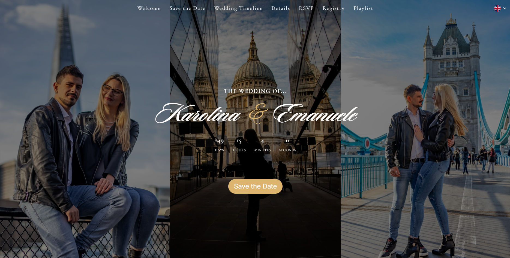
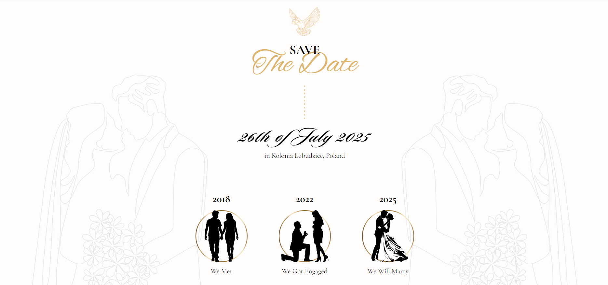
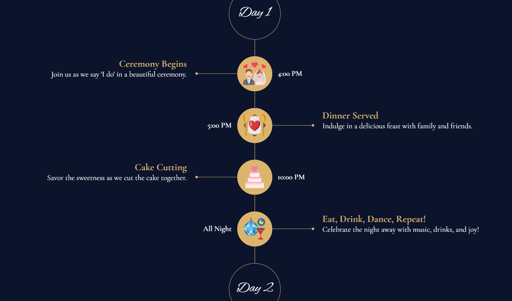
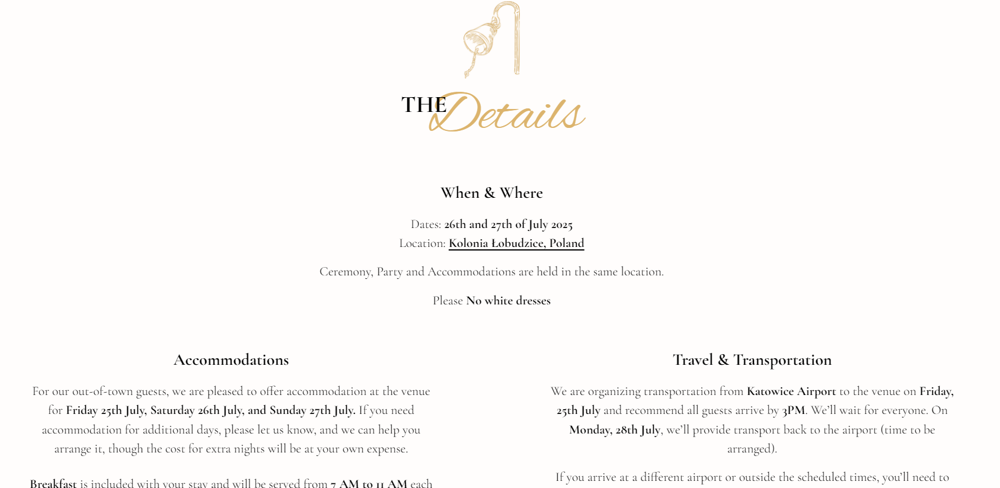
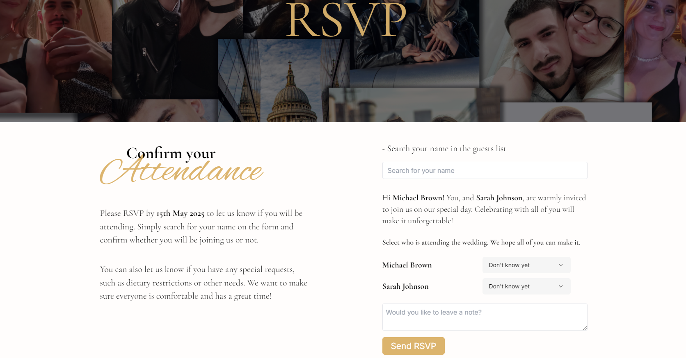
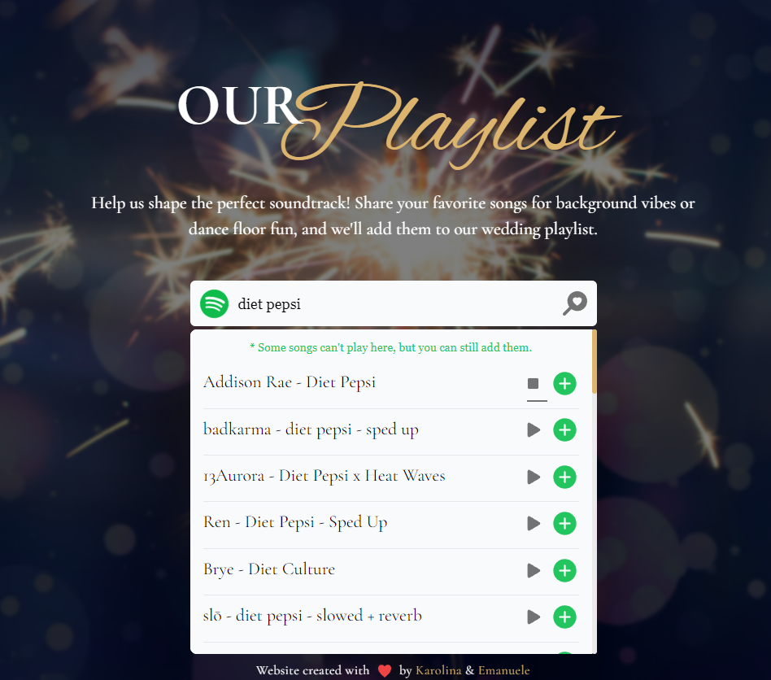
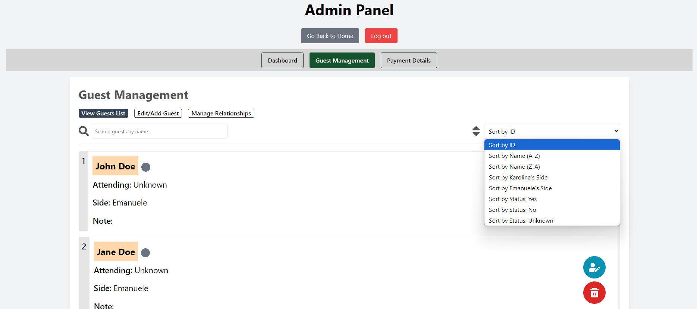
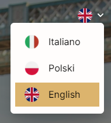

# My Wedding Invitation Website

## A Multi-Language Wedding Website tempalte

[Live Demo](https://emanuelekarolina.vercel.app/)

---

## Technologies Used

- Next.js
- Tailwind CSS
- Firebase (Firestore, Authentication)
- Framer Motion
- EmailJS
- Spotify

---

## Description

I created this website for my wedding, but it can be used as a template for anyone (see [LICENSE](./LICENSE.md)). This multilingual wedding website (currently supporting English, Italian, and Polish) includes several features such as RSVP functionality, a password-protected registry section for bank details, a music suggestion feature integrated with Spotify, and an admin panel to manage your guest list and more.

### Features

This multilingual wedding website template is designed for an elegant and modern user experience, covering all essential aspects of a wedding event. Below are some of the key features:

- **Welcome Section**: full-screen hero section featuring the couple's photos, names, and a countdown to the wedding day.

  

- **Save the Date**: A dedicated section to highlight the wedding date, presented in a simple yet elegant design.

  

- **Wedding Timeline**: A modern timeline feature that outlines the wedding day schedule in a clear and visually appealing way.

  

- **Details Section**: Provides important information about accommodation, transportation, and other wedding logistics.

  

- **RSVP Section**: Allows guests to search for their names on the guest list and confirm their attendance. The system is smartly designed to handle guest relationships, enabling joint RSVPs for couples or families, and sends notifications via email once an RSVP is submitted.

  

- **Gift Registry**: A clean and straightforward section for sharing gift registry information.

  

- **Music Suggestion Section**: Guests can search for songs, preview them, and add their choices directly to a Spotify playlist for the wedding. Integrated with Spotify for seamless playlist management.

  

- **Admin Panel**: Accessible via Google authentication, the admin panel allows for easy management of the guest list and gift registry bank details. Admins can view, edit, and delete guests or relationships and sort and search through the guest list.

  

- **Gallery with Parallax Effect**: A visually engaging photo gallery with a smooth parallax effect.

  

- **Multilingual Support**: The website automatically detects and displays the appropriate language (if supported) based on the user's browser settings. Currently, it supports English, Italian, and Polish, with the ability to easily add or remove languages.

  

- **Password-Protected Bank Details**: For those wishing to send gifts via bank transfer, the website offers a secure, password-protected section for sharing bank details like IBAN.

  
  

- The website is fully responsive.

---

## Installation and Usage

### Prerequisites

- Node.js (v16+)
- Firebase Account
- Spotify Account
- Spotify Playlist
- Git

### Installation

1. Clone the repository:

   ```bash
   git clone https://github.com/Emanuele-Sgroi/My-Wedding-Invitation-Website.git

   ```

   ```bash
   cd My-Wedding-Invitation-Website

   ```

2. Install dependencies:

   ```bash
   npm install

   ```

3. **Set Up Firebase:**

   - Create a Firebase project and Firestore database.
   - Set up authentication for Google Sign-In.
   - In Firestore, create collections to store data. **View Example Below**

4. **Set Up Spotify API:**

   - Create a Spotify developer account and set up a new app to get your **Client ID** and **Client Secret**.
   - In yuor normal Spotify account, create a Spotify playlist where song suggestions will be added.

5. **Environment Variables:**

   Create a `.env.local` file in the root directory and add your environment variables:

```bash
# Firebase
NEXT_PUBLIC_FIREBASE_API_KEY=your_public_firebase_key
NEXT_PUBLIC_FIREBASE_AUTH_DOMAIN=your_public_firebase_auth_domain
NEXT_PUBLIC_FIREBASE_PROJECT_ID=your_public_firebase_project_id
NEXT_PUBLIC_FIREBASE_STORAGE_BUCKET=your_public_firebase_storage_bucket
NEXT_PUBLIC_FIREBASE_MESSAGING_SENDER_ID=your_public_firebase_messaging_sender_id
NEXT_PUBLIC_FIREBASE_APP_ID=your_public_firebase_app_id
FIREBASE_PRIVATE_KEY=your_private_firebase_key
FIREBASE_CLIENT_EMAIL=your_firebase_client_email
FIREBASE_PROJECT_ID=your_firebase_project_id
# Email js
NEXT_PUBLIC_EMAILJS_SERVICE_ID=your_public_emailjs_service_id
NEXT_PUBLIC_EMAILJS_TEMPLATE_ID=your_public_emailjs_template_id
NEXT_PUBLIC_EMAILJS_PUBLIC_KEY=your_public_emailjs_public_key
# Spotify
SPOTIFY_CLIENT_ID=your_spotify_client_id
SPOTIFY_CLIENT_SECRET=your_spotify_client_secret
SPOTIFY_PLAYLIST_ID=your_spotify_playlist_id
SPOTIFY_REDIRECT_URI=e.g. http://localhost:3000/api/auth/callback
SPOTIFY_REFRESH_TOKEN=your_spotify_refresh_token
# Other
GUEST_ACCESS_PASSWORD=e.g. TempPassword123
NEXT_PUBLIC_ADMIN_ACCESS_PASSWORD=e.g. AdminPassword123
NEXT_PUBLIC_ALLOWED_ADMIN_EMAIL=example@youradminemail.com
```

4.  **Run the Application:**
    To start the development server:

```bash
 npm run dev
```

Visit [http://localhost:3000](http://localhost:3000) to view the website locally.

---

### Example Firestore Structure

Below is an example of the Firestore structure:

#### **Guests Collection**

- **Collection**: `guests`
  - **Document ID**: `guest_id` (e.g., `1`, `2`, `3`)
    - `id`: _Number_ (e.g., `1`)
    - `name`: _String_ (e.g., `"John Doe"`)
    - `attending`: _String_ (`"Yes"`, `"No"`, `"Unknown"`)
    - `note`: _String_ (e.g., `""`)
    - `relationshipIds`: _Array of Numbers_ (e.g., `[2, 3]`)

#### **Relationships (Managed via `relationshipIds` in Guests)**

- Relationships are managed through the `relationshipIds` field in each guest document, referencing the `id`s of related guests.

#### **Payment Data Collection**

- **Collection**: `payment_data` (or `bank_details`)
  - **Document ID**: `currencies`
    - **Fields**:
      - **EUR**: _Map_
        - `iban`: _String_ (e.g., `"DE12345678901234567890"`)
        - `accountHolder`: _String_ (e.g., `"John Doe"`)
        - `bankName`: _String_ (e.g., `"Example Bank"`)
        - `bic`: _String_ (e.g., `"EXAMPLEDX"`)
      - **GBP**: _Map_
        - `sortCode`: _String_ (e.g., `"12-34-56"`)
        - `accountNumber`: _String_ (e.g., `"12345678"`)
        - `accountHolder`: _String_ (e.g., `"John Doe"`)
        - `bankName`: _String_ (e.g., `"Example Bank UK"`)
      - **PLN**: _Map_
        - `iban`: _String_ (e.g., `"PL27114020040000300201355387"`)
        - `accountHolder`: _String_ (e.g., `"John Doe"`)
        - `bankName`: _String_ (e.g., `"Example Bank Poland"`)
        - `bic`: _String_ (e.g., `"BREXPLPWXXX"`)

---

### License

This project is licensed under a [Custom License](LICENSE.md). Please read the license to understand how to use this template properly.

---

### Contribution

Contributions are welcome! If you'd like to improve the project, feel free to submit a pull request. Any contributions made will be under the same custom license, and contributors will receive appropriate credit.

---

**HAPPY CODING** 🚀🚀🚀
